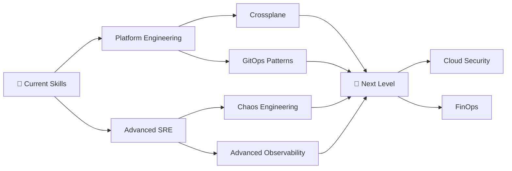

<div align="center">

<!-- ==================== HERO BANNER ==================== -->


<br/>

[](https://git.io/typing-svg)

<br/>


&nbsp;&nbsp;
[](https://www.linkedin.com/in/hrithik-kanugula-266140219/)
&nbsp;&nbsp;
[](https://github.com/hrithik17kanugula)

<br/><br/>

</div>

---

<!-- ==================== ABOUT ME ==================== -->

## 👨‍💻 About Me


Hi there! I'm **Hrithik Kanugula**, a passionate **DevOps & Site Reliability Engineer** based in **Hyderabad, India 🇮🇳**, with **3+ years** of hands-on experience building, automating, and scaling cloud-native infrastructure.

I specialize in **Kubernetes administration**, **Terraform automation**, **CI/CD pipeline engineering**, and **production observability** — with a strong track record in the **Digital Payments domain**, where reliability and uptime aren't optional.

My mission: *automate everything, monitor everything, and leave systems better than I found them.*

<br/>

| | |
|---|---|
| 🔭 | Working on **Cloud Native Infrastructure & Platform Engineering** |
| 🌱 | Learning **Platform Engineering, SRE Principles & GitOps** |
| ⚡ | Automating Infrastructure with **Terraform & IaC** |
| 🚀 | Building **CI/CD Pipelines** for rapid, reliable deployments |
| 📊 | Monitoring production systems with **Prometheus & Grafana** |
| ☁️ | Exploring **Advanced Kubernetes** patterns and best practices |
| 💬 | Ask me about **Kubernetes, Terraform, AWS, CI/CD, Docker** |
| 📍 | Based in **Hyderabad, India** |

<br/>

---

<!-- ==================== TECH STACK ==================== -->

## 🛠️ Tech Stack & Tools

<div align="center">

### ☁️ Cloud Platforms


### 🐳 Containers & Orchestration


### 🏗️ Infrastructure as Code


### 🔄 CI/CD & GitOps


### 📊 Monitoring & Observability


### 💻 Programming & Scripting


### 🖥️ Operating Systems


### 🗂️ Version Control


### 🔗 Blockchain


</div>

---

<!-- ==================== PROFESSIONAL HIGHLIGHTS ==================== -->

## 🏆 Professional Highlights

```yaml
# Hrithik Kanugula — DevOps & SRE Engineer
experience:
  years: 3+
  domain: Digital Payments Infrastructure

key_achievements:
  - ✔  Managed production-grade Kubernetes deployments at scale
  - ✔  Automated cloud infrastructure provisioning using Terraform
  - ✔  Built CI/CD pipelines with Jenkins, GitHub Actions & GitLab CI
  - ✔  Delivered multi-cloud solutions across AWS, Azure and GCP
  - ✔  Implemented end-to-end monitoring with Prometheus & Grafana
  - ✔  Engineered high-availability Digital Payments infrastructure
  - ✔  Adopted GitOps workflows and progressive delivery with ArgoCD
  - ✔  Containerized workloads with Docker and orchestrated via Helm

core_strengths:
  reliability:   "99.9%+ SLA focus"
  automation:    "Infrastructure-as-Code first approach"
  observability: "Metrics, Logs & Alerting pipelines"
  collaboration: "Cross-functional DevOps culture enabler"
```

---

<!-- ==================== CURRENTLY LEARNING ==================== -->

## 📚 Learning Roadmap

<div align="center">



</div>

| 🎯 Area | 📖 Topic | 🔄 Status |
|---------|----------|-----------|
| 🏗️ Platform Engineering | Internal Developer Platforms | 🔄 In Progress |
| 🔍 Site Reliability Engineering | SLOs, SLAs, Error Budgets | 🔄 In Progress |
| 🔄 GitOps | Flux CD, ArgoCD Advanced | ✅ Ongoing |
| 🌐 Crossplane | Cloud Control Plane | 📌 Planned |
| ⚓ Advanced Kubernetes | Operators, CRDs, Multi-cluster | 🔄 In Progress |
| 🔒 Cloud Security | Zero Trust, IAM Best Practices | 📌 Planned |
| 📡 Observability | OpenTelemetry, eBPF, Tracing | 🔄 In Progress |

---

<!-- ==================== GITHUB STATS ==================== -->

## 📈 GitHub Statistics

<div align="center">


&nbsp;&nbsp;


</div>

<div align="center">


</div>

---

<!-- ==================== DEVOPS TOOLKIT GRID ==================== -->

## 🧰 DevOps Toolkit

<div align="center">

<table>
  <tr>
    <td align="center" width="110">
      
      <br/><sub><b>AWS</b></sub>
    </td>
    <td align="center" width="110">
      
      <br/><sub><b>Azure</b></sub>
    </td>
    <td align="center" width="110">
      
      <br/><sub><b>GCP</b></sub>
    </td>
    <td align="center" width="110">
      
      <br/><sub><b>Docker</b></sub>
    </td>
    <td align="center" width="110">
      
      <br/><sub><b>Kubernetes</b></sub>
    </td>
    <td align="center" width="110">
      
      <br/><sub><b>Helm</b></sub>
    </td>
  </tr>
  <tr>
    <td align="center" width="110">
      
      <br/><sub><b>Terraform</b></sub>
    </td>
    <td align="center" width="110">
      
      <br/><sub><b>GitHub Actions</b></sub>
    </td>
    <td align="center" width="110">
      
      <br/><sub><b>Jenkins</b></sub>
    </td>
    <td align="center" width="110">
      
      <br/><sub><b>GitLab CI</b></sub>
    </td>
    <td align="center" width="110">
      
      <br/><sub><b>ArgoCD</b></sub>
    </td>
    <td align="center" width="110">
      
      <br/><sub><b>Prometheus</b></sub>
    </td>
  </tr>
  <tr>
    <td align="center" width="110">
      
      <br/><sub><b>Grafana</b></sub>
    </td>
    <td align="center" width="110">
      
      <br/><sub><b>Linux</b></sub>
    </td>
    <td align="center" width="110">
      
      <br/><sub><b>Python</b></sub>
    </td>
    <td align="center" width="110">
      
      <br/><sub><b>Bash</b></sub>
    </td>
    <td align="center" width="110">
      
      <br/><sub><b>Git</b></sub>
    </td>
    <td align="center" width="110">
      
      <br/><sub><b>GitHub</b></sub>
    </td>
  </tr>
</table>

</div>

---

<!-- ==================== GITHUB TROPHIES ==================== -->

## 🏅 GitHub Trophies

<div align="center">

[](https://github.com/ryo-ma/github-profile-trophy)

</div>

---

<!-- ==================== ACTIVITY GRAPH ==================== -->

## 📊 Contribution Activity

<div align="center">

[](https://github.com/ashutosh00710/github-readme-activity-graph)

</div>

---

<!-- ==================== CONNECT WITH ME ==================== -->

## 🤝 Connect With Me

<div align="center">

<a href="https://www.linkedin.com/in/hrithik-kanugula-266140219/">
  
</a>
&nbsp;&nbsp;
<a href="https://github.com/hrithik17kanugula">
  
</a>

<br/><br/>

💼 **Open to:** DevOps Engineer · Cloud Engineer · Platform Engineer · Kubernetes Engineer · SRE roles

📧 **Let's build scalable, reliable systems together!**

</div>

---

<!-- ==================== FOOTER ==================== -->

<div align="center">


<br/>

*"Building scalable infrastructure, automating deployments, and continuously improving reliability through DevOps and Cloud Engineering."*

<br/>


</div>
